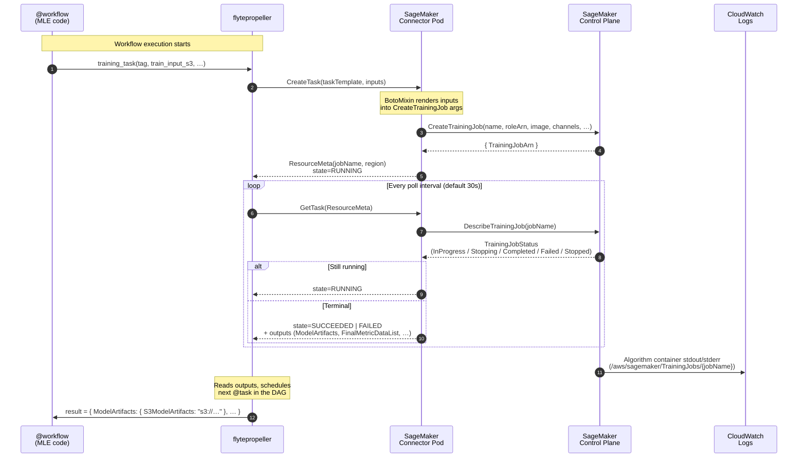
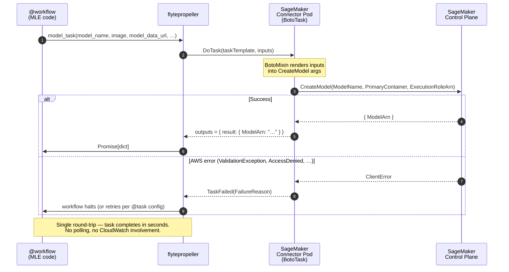
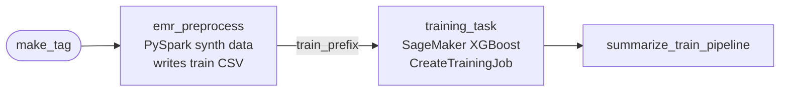
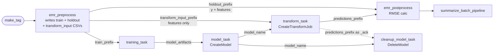

# Flyte – AWS SageMaker Support

> **TL;DR** – The ML Platform exposes **Databricks Classic** as the only
> training / batch-scoring compute today. This work adds **AWS SageMaker
> Training and Batch Transform** as a first-class option **through Flyte**,
> paired with **AWS EMR Serverless** for the pre- and post-processing
> steps. The selling point: MLEs author SageMaker pipelines using the
> same `@task` / `@workflow` DSL they already use for Databricks, with
> zero bespoke orchestration code and no new IAM/S3 work.
>
> **Scope of this page:** SageMaker **Training** + **Batch Transform**,
> end-to-end with EMR Serverless pre/post. **Live (real-time) inference is
> future scope** — the connector supports it, but rollout, ownership and
> production hardening are explicitly out of scope for this initiative
> (see §8).
>
> Audience: architects, ML engineers, ML platform engineers.

---

## 1. Background & motivation

### 1.1 Where we are today

MLEs on the ML Platform have a **single** option for model training and
batch scoring: **Databricks Classic**, orchestrated through Flyte. It's
a perfectly good option for Spark-native workloads, but it leaves three
gaps:

| Gap on Databricks-only ML Platform | What MLEs do today |
|---|---|
| **No AWS-native deep-learning compute** (managed XGBoost / DLC images / GPU instances / SageMaker built-ins) | Work around with custom Databricks clusters or move off-platform entirely |
| **Single-vendor compute lock-in** | Hard to compare $/run, $/GPU-hour, time-to-result against AWS native options |
| **Pre/post-processing forced onto the same Databricks cluster** that does training | Either pay for a large cluster end-to-end or break the pipeline across systems |

The platform team's strategic intent is to expose **more compute backends behind the same Flyte interface**, so MLEs pick the right tool per workload without learning a new orchestration framework each time.

### 1.2 What this initiative adds

This page documents the first non-Databricks compute path on Flyte:

```
┌──────────────────────────────────────────────────────────────────┐
│  MLE writes a Flyte @workflow (same DSL as today's Databricks)   │
└──────────────────────────────────────────────────────────────────┘
                              │
                              ▼
        ┌───────────────────────────────────────────┐
        │  AWS EMR Serverless        (pre/post)     │  ◀── NEW
        │  AWS SageMaker Training    (training)     │  ◀── NEW
        │  AWS SageMaker Batch Transform (scoring)  │  ◀── NEW
        │  AWS SageMaker Inference (live endpoint)  │  ◀── FUTURE
        │  Databricks Classic        (existing)     │  (unchanged)
        └───────────────────────────────────────────┘
```

Concretely, we introduce two connector families on the Flyte control plane:

- **`flytekitplugins-awssagemaker`** — driving SageMaker Training, Batch Transform, and (for future scope) Inference endpoint CRUD.
- **`flytekitplugins-awsemrserverless`** — driving EMR Serverless applications in Pythonic mode for Spark-based pre/post-processing.

Together they give MLEs an **end-to-end AWS-native** path that they
author entirely in Flyte — the same way they author their Databricks
pipelines today.

### 1.3 Why this matters (the selling points)

**For MLEs**

1. **Same Flyte DSL they already know.** No new SDK, no new submission tooling. If they can write a Databricks `@task`, they can write a SageMaker `@task` — the example repo provides a copy-paste starting point.
2. **More compute choice.** XGBoost built-in, BYOC, GPU instances, multi-instance training — anything SageMaker supports is available without leaving Flyte.
3. **Spark pre/post when they want it, not bundled with training.** EMR Serverless handles the heavy data prep; SageMaker handles only the model step; results are joined back via more EMR Serverless. Each step is sized independently.
4. **No bespoke IAM / S3 work.** Roles and buckets are MLOS-issued; workflows reference them by ARN in a single env-scoped YAML.
5. **Full Flyte observability.** Lineage, retries, caching, the Flyte UI — same observability story as every other Flyte workflow.

**For architects & ML Platform**

1. **Vendor optionality.** $/run, training time, GPU availability can now be compared head-to-head against Databricks for real workloads.
2. **MLOS / MLP boundary preserved.** MLOS owns roles and buckets; MLP owns Flyte + connectors; MLE consumes them. The diagram in §1.4 traces every responsibility back to a specific team.
3. **Path to upstream contribution.** The connector work is being prepared as an OSS contribution to [`flyteorg/flytekit#4079`](https://github.com/flyteorg/flytekit/issues/4079) — the platform isn't carrying a private fork forever.
4. **Future-proof for additional AWS services.** The connector pattern (async + sync `BotoTask`) generalizes to other AWS services (SageMaker Processing, Bedrock batch, etc.) when MLEs ask for them.
5. **Live serving deliberately gated.** We've explored live endpoint deployment via the same connector and intentionally **scoped it out for now** — Flyte's strength is batch orchestration, not 24×7 endpoint custodianship. See §7 for the recommendation.

### 1.4 Where this slots into the ML Platform

The attached diagram (*ML Platform Flyte – Connectors Now and Future*) is the architect's view of the world. Annotated:

```
            ┌──────────────────────────────────────────────────────────────┐
            │ MLOS / MLP                                                   │
            │   • IAM Roles (Flyte execution role + connector role)        │
            │   • S3 buckets (per-domain, per-env)                         │
            │   • Glue Catalog tables (EGDL)                               │
            └──────────────────────────────┬───────────────────────────────┘
                                           │ pre-issued, reused by every workflow
                                           ▼
   ┌──────────────┐    ┌──────────────────────────────────────────────────┐
   │ MLE Git repo │───▶│ Flyte control plane                              │
   │ (ML template)│    │   • flytepropeller                                │
   └──────────────┘    │   • EMR Serverless connector (async)              │
                       │   • SageMaker training connector (async)          │
                       │   • SageMaker batch transform connector (async)   │
                       │   • SageMaker inference connector (sync boto)     │
                       └──────────────────────────────────────────────────┘
                                           │
                  ┌────────────────────────┼────────────────────────┐
                  ▼                        ▼                        ▼
        ┌─────────────────┐      ┌─────────────────┐      ┌─────────────────┐
        │ EMR Serverless  │      │ AWS SageMaker   │      │ Databricks /    │
        │ (Spark pre/post │◀────▶│ Training +      │      │ Glue Catalog    │
        │  processing)    │      │ Batch Transform │      │ (read/write)    │
        └─────────────────┘      └─────────────────┘      └─────────────────┘
                  │                        │
                  └────────────┬───────────┘
                               ▼
                       ┌────────────────────┐
                       │ S3 (MLOS bucket)   │
                       │  prepared/         │
                       │  predictions/      │
                       │  models/           │
                       └────────────────────┘
```

The Flyte execution role + connector role are **provisioned once by MLOS** and consumed by every MLE workflow. No project-level IAM work is needed beyond requesting the role.

### 1.5 Out of scope for this page

| Item | Why it's out of scope here |
|---|---|
| **SageMaker live (real-time) inference endpoints** | The connector supports it (sync `CreateEndpoint*`/`DeleteEndpoint*` tasks); we've smoke-tested it. **Productionizing** live serving on Flyte is a separate decision — ownership, blue/green rollouts, drift detection, on-call sit better with a dedicated model-serving platform. See §7 and the decision doc `FLYTE_LIVE_SERVING_DECISION.md`. |
| **SageMaker Processing Jobs** | Out of scope; EMR Serverless covers the pre/post-processing use cases we currently see. Could be added later as a separate connector family. |
| **Migration of existing Databricks workflows to SageMaker** | Existing pipelines stay on Databricks. This is purely **additive** — a new option, not a replacement. |
| **GPU capacity / quota planning** | Standard SageMaker quota management. Not Flyte-specific. |

---

## 2. How the connector works

`flytekitplugins-awssagemaker` ships **four sub-packages**, each a separate
`@task` family backed by a Flyte connector running on the control plane:

| Sub-package | Action | Connector type | Why this split |
|---|---|---|---|
| `flytekitplugins.awssagemaker_training` | `CreateTrainingJob` | **Async** | Long-running (minutes–hours), Flyte polls until terminal state |
| `flytekitplugins.awssagemaker_batch_transform` | `CreateTransformJob` | **Async** | Long-running, same polling pattern |
| `flytekitplugins.awssagemaker_inference` | `CreateModel`, `CreateEndpointConfig`, `CreateEndpoint`, `UpdateEndpoint`, `DeleteEndpoint`, `DeleteEndpointConfig`, `DeleteModel` | **Sync (BotoTask)** | One-shot boto3 call, completes in seconds |
| `flytekitplugins.awssagemaker_inference.boto3_mixin` | Internal | Shared helper | Single point for retry/serialization across all the above |

### 2.1 Async connector lifecycle

Used for **`CreateTrainingJob`** and **`CreateTransformJob`**: long-running operations where Flyte polls SageMaker until the job reaches a terminal state. The connector itself is stateless — all state lives in the `ResourceMeta` returned by `create()` and re-passed into `get()`.



**Failure handling:** if `DescribeTrainingJob` returns `Failed`, the connector surfaces `FailureReason` straight into the Flyte task error, so it shows up in the Flyte UI without an extra log dive. Retries are configured via `@task(retries=N)` and replay the **whole** `CreateTrainingJob` call (new job name each retry — the connector ensures idempotence via a token).

The connector pod is shared across every workflow that uses the plugin; MLEs do **not** need to deploy anything per project. Connector IAM principal needs `sagemaker:*` on the training/transform job ARNs + `iam:PassRole` for the SageMaker execution role.

### 2.2 Sync connector lifecycle

Used for **`CreateModel`**, **`CreateEndpointConfig`**, **`CreateEndpoint`**, **`UpdateEndpoint`**, **`DeleteEndpoint`**, **`DeleteEndpointConfig`**, **`DeleteModel`**: one-shot boto3 calls that complete in seconds. Implemented as `SyncConnectorBase` / `BotoTask` — no polling, no `ResourceMeta`, no state machine.



**Why split sync vs async?** The boto API mirrors this distinction directly: `CreateTrainingJob` returns a handle and you poll, while `CreateModel` returns a final ARN. Mapping sync resources onto the async polling machinery would double the connector pod load with no benefit.

### 2.3 Side-by-side comparison

| Aspect | Async (`CreateTrainingJob`, `CreateTransformJob`) | Sync (`CreateModel`, `DeleteModel`, endpoint CRUD) |
|---|---|---|
| Connector base class | `AsyncConnectorBase` | `SyncConnectorBase` (`BotoTask`) |
| State storage | `ResourceMeta` (jobName, region) round-tripped each poll | None — single round-trip |
| Polling | `flytepropeller` calls `GetTask` every N seconds | N/A |
| Typical duration | minutes – hours | seconds |
| Output retrieval | `DescribeTrainingJob` / `DescribeTransformJob` in `get()` | Direct boto response in `do()` |
| Failure surface | `FailureReason` field from `Describe*Job` | boto `ClientError` mapped to `TaskFailed` |
| Idempotence | New job name per retry (handled by Flyte input cache + token) | Caller responsible — re-issuing `CreateModel` with same name fails with `ResourceInUse` |
| CloudWatch logs | `/aws/sagemaker/{TrainingJobs,TransformJobs}/{jobName}` | None (control-plane call only) |
| Example tasks | `training_task`, `transform_task` | `model_task`, `cleanup_model_task`, `endpoint_*_task` |

### 2.4 Pythonic mode for EMR Serverless

EMR Serverless tasks run in **Pythonic mode** (PySpark inside a regular `@task` body), not the legacy "submit a script" mode. The worker image contains `flytekitplugins-awsemrserverless` + Spark; MLE code is just `from pyspark.sql import SparkSession; ...`.

### 2.5 Module-split discipline (important)

Flyte tasks execute in **four different environments**:

1. **Registration host** (MLE laptop running `pyflyte run`) — full plugin set installed.
2. **Default Flyte task pod** — plain Python, no SageMaker or EMR plugins.
3. **EMR Serverless worker** — EMR plugin only.
4. **SageMaker connector pod** — SageMaker plugin only.

A single `import flytekitplugins.awssagemaker_training` at the top of a module that also defines a plain `@task` will crash the default pod with `ModuleNotFoundError`. The example repos enforce this 4-tier split:

| Module | Imports allowed | Runs in |
|---|---|---|
| `dtypes.py` | stdlib only (dataclasses) | Everywhere |
| `utils.py` | stdlib, `flytekit` | Default pod |
| `emr_tasks.py` | + `flytekitplugins.awsemrserverless`, `pyspark` | EMR worker |
| `train_pipeline.py` / `batch_inference_pipeline.py` | + `flytekitplugins.awssagemaker_*` | Registration + connector |

**Adoption rule:** never put a plain `@task` inside a file that imports SageMaker or EMR plugins. Keep helpers in `utils.py`, types in `dtypes.py`.

---

## 3. Features

### 3.1 SageMaker Training  *(in-scope, GA)*
- Algorithm-container or BYOC images (we test with the public SageMaker XGBoost container).
- Single-channel or multi-channel inputs (we wire `train` and `validation` channels).
- Hyperparameters passed as a Python dict.
- All `CreateTrainingJob` knobs surfaced (instance type, instance count, volume size, max-runtime).
- Returns the full `DescribeTrainingJob` response — model artifacts URL is `result["ModelArtifacts"]["S3ModelArtifacts"]`.

### 3.2 SageMaker Batch Transform  *(in-scope, GA)*
- Consumes the model artifact written by training (chain via Flyte data dependency).
- Configurable `BatchStrategy`, `SplitType`, `Assemble`.
- Predictions land at a deterministic S3 prefix that downstream EMR tasks read.

### 3.3 EMR Serverless pre/post-processing  *(in-scope, GA)*
- Pythonic-mode PySpark — write a `@task` body that uses `SparkSession` directly.
- Same lineage and Flyte UI surface as any other task.
- Shares the MLOS-issued S3 bucket with the SageMaker tasks; data hand-off is a Flyte `Promise[str]` carrying an S3 prefix.

### 3.4 Model resource lifecycle (sync `CreateModel` / `DeleteModel`)  *(in-scope, GA)*
- Required to register the trained model artifact before batch transform can reference it.
- `cleanup_model_task` is wired into the workflow DAG so the `Model` resource is deleted even on partial failure (uses the `_ack` ordering trick — see §3.6).

### 3.5 SageMaker live (real-time) inference endpoints  *(FUTURE SCOPE)*
- Sync connector tasks exist: `CreateEndpointConfig` / `CreateEndpoint` / `UpdateEndpoint` / `DeleteEndpoint*`.
- Smoke-tested end-to-end (deploy → predict → tear down) in `deployment_workflow.py`.
- **Not part of this rollout.** Productionizing live serving on Flyte (ownership, blue/green, drift, on-call) is a separate decision; see §7 *Production guidance* and `FLYTE_LIVE_SERVING_DECISION.md`. We ship the code so MLEs can use it for dev / POC / short-lived A/B experiments, not as the recommended production serving path.

### 3.6 Ordering safety with `_ack` inputs

### 3.4 Ordering safety with `_ack` inputs
Flytekit 1.16 returns an `Output` wrapper (not a `Promise`) for tasks that emit a single value or a dataclass. The `>>` ordering operator doesn't work on `Output`. The connector tasks expose an optional **`_ack: str` input** (ignored by the boto call) so MLEs can thread an unrelated `Promise` into the destructor task, creating an explicit data dependency. Example: `cleanup_model_task(_ack=predictions_prefix)` ensures `DeleteModel` runs strictly after the batch transform produces predictions.

### 3.5 Implicit dependency on MLOS-issued resources
- The SageMaker execution role ARN is **never** hard-coded in workflow code; it's resolved from a per-env YAML (`config/test/sagemaker.yaml`) loaded on the registration host.
- The S3 output bucket is resolved the same way — workflows are portable across `test` / `prod` by swapping the config dir.

---

## 4. Adoption guide

### 4.0 Orientation for current Databricks users

If you've shipped a Flyte + Databricks pipeline before, the new SageMaker / EMR path follows the **same mental model**. The table below maps the muscle memory across:

| Step | Today on Databricks Classic | New SageMaker + EMR path |
|---|---|---|
| Where the workflow code lives | Your Git repo, `@workflow` in a Flyte file | Same |
| How you submit | `pyflyte run --remote …` | Same (add `--copy all` because we ship YAML configs) |
| Pre/post data prep | `@databricks_task` (`pyspark` on a Databricks cluster) | `@task` body (PySpark on **EMR Serverless** — Pythonic mode) |
| Model training compute | `@databricks_task` running an MLflow Spark job | `training_task` (**SageMaker `CreateTrainingJob`**) |
| Batch scoring compute | `@databricks_task` running a Spark inference job | `transform_task` (**SageMaker `CreateTransformJob`**) |
| IAM / cluster setup | Databricks workspace + IAM role | MLOS-issued SageMaker + EMR Serverless execution roles (referenced by ARN in YAML) |
| Observability | Flyte UI + Databricks job UI | Flyte UI + SageMaker console + EMR Serverless console |
| Lineage / retries / caching | Flyte | Same (Flyte) |

The new connectors do not replace anything — your existing Databricks workflows keep working. This is purely additive.

### 4.1 Prerequisites
| Item | Owner | Notes |
|---|---|---|
| Flyte project + domain | MLP | Already provisioned (`-p <project> -d <env>`) |
| Flyte execution role (`mlp-…-flyte-…`) | MLOS | Trust includes `flytepropeller`; permissions include S3 read/write on the domain bucket, `iam:PassRole` on the SageMaker execution role, `sagemaker:*` on workflow-owned resource ARNs, `emr-serverless:*` on workflow-owned applications |
| SageMaker execution role | MLOS | Trust principal: `sagemaker.amazonaws.com`; permissions: S3 read/write on the domain bucket, ECR pull on SageMaker built-in images |
| EMR Serverless execution role | MLOS | Trust principal: `emr-serverless.amazonaws.com`; permissions: S3 read/write on the domain bucket, optional Glue catalog read |
| Domain S3 bucket | MLOS | One per env, per domain; e.g. `mlp-ai-ml-core-test-<acct>-<region>` |
| EMR Serverless application | MLP / MLE | Pre-warmed if low-latency runs are required |
| SageMaker connector deployed | MLP | Single shared connector pod; deployed via the platform Helm chart |
| EMR Serverless connector deployed | MLP | Same |

### 4.2 Install
The `flytekitplugins-awssagemaker` package on PyPI doesn't yet expose the
`awssagemaker_training`, `awssagemaker_batch_transform`, and
`awssagemaker_inference` sub-packages we need. Until the next upstream
release, install the local fork in editable mode:

```bash
git clone https://github.expedia.biz/eg-ai-platform/flytekit-sagemaker.git
cd flytekit-sagemaker
pip install -e plugins/flytekit-aws-sagemaker
pip install flytekit flytekitplugins-awsemrserverless pyyaml
```

### 4.3 First workflow — single-task training
Copy `ml-example-flyte-aws-sagemaker/ml_example_flyte_aws_sagemaker/training_workflow.py` as your starting point:

1. Replace the `make_tag` output with whatever run identifier you use.
2. Point `train_input_s3` at your pre-staged training CSV / Parquet.
3. Update `config/<env>/sagemaker.yaml` with your role ARN and output bucket.
4. Register and run:

```bash
pyflyte run --remote --copy all \
  -p <project> -d <env> \
  --destination-dir "." \
  ml_example_flyte_aws_sagemaker/training_workflow.py training_workflow
```

### 4.4 End-to-end — EMR pre → SM train → SM batch → EMR post
This is the recommended adoption pattern for "I have raw data and need predictions back". Copy `ml-example-flyte-aws-sagemaker/integrated/` and modify three things:

1. `emr_preprocess` — replace the synthetic `spark.range(...)` block with your real source read (Glue table, S3 CSV, Iceberg, etc.).
2. `emr_postprocess` — replace the RMSE calculation with your real downstream aggregation / write-back.
3. `config/<env>/workflow.yaml` — tune `synthetic_rows`, `holdout_fraction`, instance types, hyperparameters.

The rest of the DAG, IAM wiring, S3 layout, ordering and cleanup logic are reusable as-is.

---

## 5. Example workflows shipped today

All examples live in [`ml-example-flyte-aws-sagemaker`](https://github.expedia.biz/eg-ai-platform/ml-example-flyte-aws-sagemaker).

| # | Workflow | Path | What it demonstrates |
|---|---|---|---|
| 1 | `training_workflow` | `ml_example_flyte_aws_sagemaker/training_workflow.py` | Smallest possible SageMaker training task wired into Flyte |
| 2 | `training_and_batch_workflow` | `ml_example_flyte_aws_sagemaker/training_and_batch_workflow.py` | Training → `CreateModel` → batch transform, with cleanup |
| 3 | `deployment_workflow` / `teardown_workflow` | `ml_example_flyte_aws_sagemaker/deployment_workflow.py` | **(FUTURE SCOPE)** Live endpoint deploy + smoke predict + delete. Reference implementation only — see §8 before adopting for production. |
| 4 | `train_pipeline_workflow` | `integrated/ml_example_flyte_emr_sagemaker/train_pipeline.py` | **EMR Serverless preprocess → SageMaker training** |
| 5 | `batch_inference_pipeline_workflow` | `integrated/ml_example_flyte_emr_sagemaker/batch_inference_pipeline.py` | **EMR preprocess → SM train → CreateModel → SM batch transform → EMR postprocess → DeleteModel** |

### 5.1 Pipeline 4 — EMR preprocess + SageMaker training



### 5.2 Pipeline 5 — full end-to-end with cleanup



Notice the **`_ack` edge** from `tx` to `del` — that's the ordering safety pattern described in §3.4.

---

## 6. Operational concerns

### 6.1 IAM model
- **Flyte execution role** = principal that the Flyte connector pod assumes; needs `sagemaker:*` (scoped to job/model ARNs by the workflow's tag prefix) and `iam:PassRole` to the SageMaker execution role.
- **SageMaker execution role** = principal that runs *inside* the training/transform container; needs S3 read on the input prefix, S3 write on the output prefix, ECR pull on the algorithm image.
- **EMR Serverless execution role** = principal that runs *inside* the Spark driver/executors; needs S3 read/write on the domain bucket, optional Glue read.
- All three are **provisioned by MLOS**; MLEs only reference them by ARN in `config/<env>/*.yaml`.

### 6.2 S3 layout
```
s3://<domain-bucket>/flyte/emr-sagemaker/
   prepared/<tag>/
     train/part-*.csv             # (y, x1, x2)        – fed to training
     holdout/part-*.csv           # (y, x1, x2)        – fed to emr_postprocess
     transform_input/part-*.csv   # (x1, x2)           – fed to batch transform
   models/<tag>/                  # SageMaker training job output
   predictions/<tag>/             # SageMaker batch transform output
   postprocess/<tag>/             # EMR postprocess output (parquet + metrics)
```

The `<tag>` is generated once by the `make_tag` task and threaded through every downstream task, giving each run an isolated namespace. Cleanup / TTL policies can target `prepared/<tag>/` and `predictions/<tag>/` after N days.

### 6.3 Troubleshooting (failure modes we hit and the fix)

| Symptom | Root cause | Fix |
|---|---|---|
| `ModuleNotFoundError: No module named 'flytekitplugins.awssagemaker_training'` on the registration host | PyPI release of `flytekitplugins-awssagemaker` doesn't expose the sub-package yet | `pip install -e plugins/flytekit-aws-sagemaker` from the local fork |
| `ModuleNotFoundError: No module named 'flytekitplugins'` from the default Flyte pod loading a workflow file | Plain `@task` was placed in a module that also imports a `flytekitplugins.*` symbol at the top | Keep plain `@tasks` and dataclasses in `utils.py` / `dtypes.py`; only pipeline files import plugins |
| EMR Serverless worker fails with `FileNotFoundError: Workflow config not found: …/config/test/workflow.yaml` | `pyflyte run` default `--copy auto` excludes non-Python files | Use `--copy all`; tasks also fall back to placeholder config so module import survives |
| `CreateTrainingJob` rejects S3 URI like `'<tag>/train/'` (`Member must satisfy regular expression pattern: (https\|s3)://…`) | EMR worker resolved to placeholder config because YAML wasn't in the bundle | All runtime YAML values are passed as **task inputs** resolved on the registration host, not read on the worker |
| `AlgorithmError: Could not determine delimiter` from XGBoost training | Spark's `_SUCCESS` zero-byte marker was the first file XGBoost tried to sniff | Spark conf `spark.hadoop.mapreduce.fileoutputcommitter.marksuccessfuljobs=false` + post-write `_clean_spark_output()` |
| Batch transform fails with the generic `ClientError: See job logs for more information` and no CloudWatch log group | XGBoost inference received `(y, x1, x2)` when it was trained on `(x1, x2)` — container exited before logs flushed | `emr_preprocess` writes a third CSV `transform_input/` with features only; batch transform wired to that prefix |
| `CreateTransformJob: Could not find model "emr-sm-model-<tag>"` | `DeleteModel` raced `CreateTransformJob` because both depended only on `model_name` | `cleanup_model_task` takes an `_ack: str` input wired to `predictions_prefix`, forcing dependency on transform completion |
| `AttributeError: 'Output' object has no attribute 'ref'` registering a workflow that uses `>>` | Flytekit 1.16 returns `Output` (not `Promise`) for single-output / dataclass-output tasks; `>>` doesn't work on `Output` | Replace `>>` with a real data dependency via the `_ack` input pattern |
| `AccessDenied: iam:PassRole` from the connector | Connector pod IAM lacks `PassRole` on the SM/EMR execution role | Add `iam:PassRole` scoped to `sagemaker.amazonaws.com` and `emr-serverless.amazonaws.com` service principals |
| `CreateEndpoint*` AccessDenied even with `sagemaker:*` | Initial MLOS policy was scoped to training/transform ARNs only | Extend connector policy with `sagemaker:CreateEndpoint`, `sagemaker:CreateEndpointConfig`, `sagemaker:DeleteEndpoint*` on the relevant ARNs |

### 6.4 Reading SageMaker logs

```bash
# Primary source of truth – always works, even before container starts
aws sagemaker describe-transform-job \
  --transform-job-name emr-sm-transform-<tag> \
  --region us-east-1 --query FailureReason

# Container-level logs (only exist if the container actually started)
aws logs tail /aws/sagemaker/TransformJobs \
  --log-stream-name-prefix emr-sm-transform-<tag> \
  --region us-east-1 --since 1h --format short
```

Same pattern with `describe-training-job` / `/aws/sagemaker/TrainingJobs`.

---

## 7. Production guidance

| Use case | Recommendation |
|---|---|
| Offline training (scheduled retrains) | ✅ Use Flyte + SageMaker training connector |
| Batch inference (periodic scoring) | ✅ Use Flyte + SageMaker batch transform connector |
| Pre/post-processing | ✅ Use Flyte + EMR Serverless connector (Pythonic mode) |
| Model registry entry | ✅ Use `CreateModel` from the sync connector |
| **Live endpoint serving (real-time inference)** | ⚠️ Supported but **not recommended for prod**. See [`FLYTE_LIVE_SERVING_DECISION.md`](#) — Flyte's strength is batch/scheduled compute, not 24×7 endpoint custodianship. Ownership, drift handling, blue-green rollouts and on-call all sit better with the model-serving platform team |
| Multi-tenant endpoint serving | ❌ Out of scope for this connector — use the dedicated model serving platform |

The `deployment_workflow.py` example is shipped intentionally — it's useful for **smoke tests, dev/POC and short-lived A/B experiments**. The decision doc above outlines why we recommend against making it the production serving path.

---

## 8. Roadmap

| Item | Status | Owner |
|---|---|---|
| Upstream PR for `flytekitplugins-awssagemaker` sub-packages | Open, tracked in [flyteorg/flytekit#4079](https://github.com/flyteorg/flytekit/issues/4079) | MLP |
| Built-in tag-based IAM scoping policy template | Drafted in `local/crossplane/flyte-sagemaker-policy.tf` | MLP |
| Spark-on-SageMaker (Processing Job) connector | Not started | TBD |
| HuggingFace / PyTorch DLC example workflows | Not started | TBD |
| Model registry / MLflow integration via post-training task | Backlog | TBD |
| Auto-cleanup TTL on `prepared/<tag>/` and `predictions/<tag>/` | Bucket lifecycle policy proposal | MLOS |

---

## 9. References

- Example repo: [`ml-example-flyte-aws-sagemaker`](https://github.expedia.biz/eg-ai-platform/ml-example-flyte-aws-sagemaker) (training, batch, deployment, integrated EMR+SM)
- Reference repo: [`ml-example-flyte-emr-serverless`](https://github.expedia.biz/eg-ai-platform/ml-example-flyte-emr-serverless) (EMR-only patterns)
- Connector fork: [`flytekit-sagemaker`](https://github.expedia.biz/eg-ai-platform/flytekit-sagemaker), branch tracking upstream `flyteorg/flytekit#4079`
- Upstream issue: <https://github.com/flyteorg/flytekit/issues/4079>
- Crossplane IAM modules: `flytekit-sagemaker/local/crossplane/flyte-sagemaker-policy.tf`, `flyte-emr-serverless-policy.tf`
- Live serving decision doc: `flytekit-sagemaker/FLYTE_LIVE_SERVING_DECISION.md`

---

*Page maintained by the ML Platform team. For corrections or new examples, open an MR against `flytekit-sagemaker/docs/CONFLUENCE_FLYTE_AWS_SAGEMAKER_SUPPORT.md` and ping #ml-platform.*
